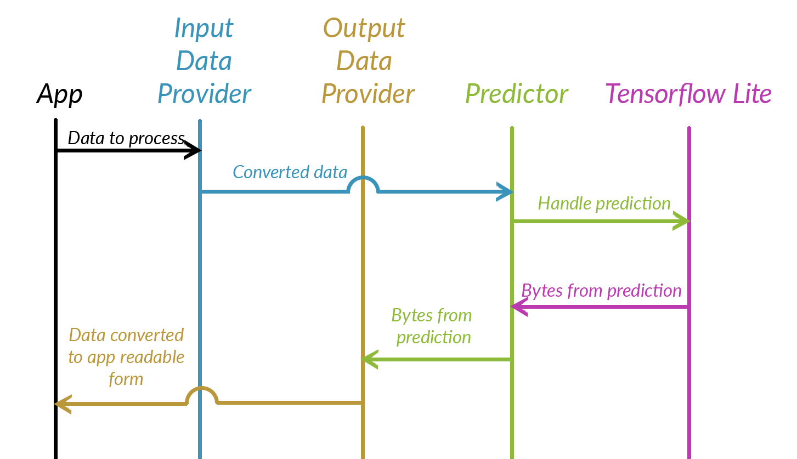

Simple library facilitating integration of Artificial Intelligence models into mobile applications.

## Table of Content

1. [Overview](#overview)
2. [Design](#design)
3. [Requirements](#requirements)
4. [Setup](#setup)
5. [Features](#fFeatures)
6. [Usage](#usage)
7. [Extending data input and output providers](#extending-data-input-and-output-providers)
8. [Call for contribution](#call-for-contribution)

## Overview

AI gets more and more into the mobile world. This library is designed to help those who want to embed an ML model into their mobile application but don't have much background in the AI field.
Are you confused which ML model to use? Tensorflow, TensorflowLite or maybe CoreML? You don't quite know how to go about them? We know your pain. We went through documentation, samples, and StackOverflow to help you with your AI tasks.

There exists also an iOS implementation of Macaque which can be found [here](https://github.com/EnigmaPatternInc/Macaque_Android).

## Design

Macaque is based on 4 main components:
 * Macaque object - that handle communication betwean InputDataProvide, OutputDataProvider, Predictor
 * InputDataProvider - converts arbitrary data into data compatible with model's input
 * OutputDataProvider - converts model's output into data format compatible with the rest of the application
 * Predictor - collects data from an InputDataProvider, handles prediction and sends data to OutputDataProvider
 
The schema below presents the main use case of Macaque
 


### Submodules provided with the library

#### Input Data Providers

* UIImageToRGBDataProvider - converts `UIImage` object to image data format accepted by ML models
* VideoStreamInputDataProvider - converts `CVImageBuffer` to the format accepted by models operating on images (Only BGRA colourspace is supported)
 
#### Output Data Providers

* Detection4OutputsBoundingBoxesDataProvider - converts detection results from 4 model outputs (Locations, Classes, Scores, # of detections) into a list of DetectionResult objects

## Requirements

Minimum version of iOS supported is 9.0, Swift 5

## Setup

Curently Macaque has to be build from sources

1. Clone repository and go to `Macaque` folder
2. Open terminal and navigate to Macaqe project folder 
3. Run `pod install`
3. Open `Macaque.xcworkspace`
4. Archive framework: 
   Top menu -> Product -> Archive
   
   In a popup window click `Distribute Content`
   
   select `Build Product` and click `Next`
   
   select folder to export and hit `Export`
5. Add Macaque.framework to your project

## Features

 - [X] Support TenforflowLite
 - [ ] Support Tensorflow 1.x.x
 - [ ] CocoaPods build
 - [X] Implementations of input and output data providers for base detection and classification models, quantized and not quantized, available out of the box
 - [ ] Implementation of output data provider for PoseNet models
 - [ ] Implementation of output data provider for detection models returning locations relative to anchor boxes
 - [ ] Support of models not based on images.
 
 ## Usage
 
 Instantiate input and output data provider:
 ```Swift
    //Standard provider that UIImage to data
    let inputDataProvider = UIImageToRGBDataProvider<UInt8>()
    // Standard provider that transform data from prediction to BoundingBoxes
    let outputDataProvider = Detection4OutputsBoundingBoxesDataProvider() 
 ```
 
 Instantiate predictor:
 ```Swift
    let predictor = try? Predictor(modelName: "detector", //Model name
                                   modelExtension: "tflite", //Model extension
                                   inputDataProvider: inputDataProvider,
                                   outputDataProvider: outputDataProvider)
 ```
 
 Pass data to input data provider:
 ```Swift
    inputDataProvider.image = UIImage(named:"ImageForDetection")
 ```
 
 Run prediction:
 ```Swift
    try? self.predictor?.predict()
 ```
 
 Get results from output data provider:
 ```Swift
    let results = outputDataProvider.getResults()
 ```
 
 ## Extending data input and output providers
 
 Unfortunately, it is impossible to cover all possible data conversion to and from model prediction. 
 We tried to design Macaque as modular as it is possible to use custom models.
 To provide any data to your model write class that will implement `OutputDataProvider` or `InputDataProvider`. 
 The rest will be handled by the predictor.
 
## Call for contribution

Our Macaque is new on the market. There is still a lot to be done before it is mature. But the base is there and it is also for you to take your part in its development! We encourage everyone to tell their thoughts, request changes or features (e.g. via GitHub issues system) and of course by improving our codebase with pull requests. Let’s make Macaque better together!
